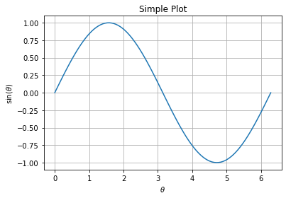
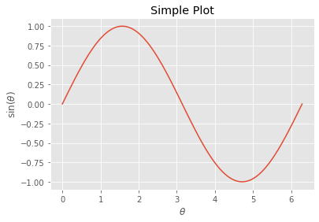

This is a MATLAB users introduction to making great plots with Matplotlib in python.

**First** we need to import the matplotlib.pyplot library, and we can access the functions in that library using the `plt` namespace, this is a typical style but any prefix works. This allows us to avoid typing `matplotlib.pyplt.function()` to call functions from that library.


```python
import matplotlib.pyplot as plt
```

Next, we need the numerical python (numpy) library. This is imported under the namespace `np`.


```python
import numpy as np
```

We need some data to plot, so we will use the `linspace` function of the `numpy` library to generate a linearly spaced array of values we will use inputs to a function.


```python
theta = np.linspace(0, 2*np.pi, 100)
```

Now, we need to *instatiate* figure and axes objects to plot things on to them. Note that there is no need to clear the frame, since a clean slate will always be generated. Also `fig` and `ax` are simply a variable choice, I could have just easily said `fig1` and `ax1`, which may happen if we want to make multiple figures.


```python
fig, ax = plt.subplots()
ax.plot(theta, np.sin(theta))
ax.set_title('Simple Plot')
ax.set_xlabel(r'$\theta$')
ax.set_ylabel(r'$\sin(\theta)$')
ax.grid(True)
```





## Advanced: Styling and Saving
We can use different in-built plot styles to make the style plot looks exactly like we want. The available styles may look different on your system, but you can easily print a list of available plot styles with the following:


```python
for style in plt.style.available:
	print(style)
```

    Solarize_Light2
    _classic_test_patch
    bmh
    classic
    dark_background
    fast
    fivethirtyeight
    ggplot
    grayscale
    seaborn
    seaborn-bright
    seaborn-colorblind
    seaborn-dark
    seaborn-dark-palette
    seaborn-darkgrid
    seaborn-deep
    seaborn-muted
    seaborn-notebook
    seaborn-paper
    seaborn-pastel
    seaborn-poster
    seaborn-talk
    seaborn-ticks
    seaborn-white
    seaborn-whitegrid
    tableau-colorblind10


```python
plt.style.use('ggplot')
# replot the plot.
fig, ax = plt.subplots()
ax.plot(theta, np.sin(theta))
ax.set_title('Simple Plot')
ax.set_xlabel(r'$\theta$')
ax.set_ylabel(r'$\sin(\theta)$')
ax.grid(True)
```





Now, we can use save the figure as a high quality pdf to include in a LaTeX document, or a png to include in a Word document. The following cell will print out a list of available filetypes.


```python
ext = fig.canvas.get_supported_filetypes().items()
for key, value in ext:
	print(f'{key}: {value}')
```

    ps: Postscript
    eps: Encapsulated Postscript
    pdf: Portable Document Format
    pgf: PGF code for LaTeX
    png: Portable Network Graphics
    raw: Raw RGBA bitmap
    rgba: Raw RGBA bitmap
    svg: Scalable Vector Graphics
    svgz: Scalable Vector Graphics


Now, we can save the figure to the current directory by using the `savefig` method of the `fig` object.


```python
fig.savefig('OOP-Plot.pdf',    #name of pdf file
			transparent=True,  #make bkgd transparent
			bbox_inches='tight'#reduce whitespace
			)
```

Sources:
- https://matplotlib.org/tutorials/introductory/lifecycle.html


```python

```
